# Neural Networks and Deep Learning

**Author:** Rajvardhan Patil

My coursework for the Neural Networks and Deep Learning course (Semester 2). It covers three lab assignments and three problem sets, from the perceptron through CNNs, batch-norm and attention, to a multimodal visual question answering project on VizWiz.

## Contents

- [Repository layout](#repository-layout)
- [Lab 1: Perceptrons and two-layer networks](#lab-1-perceptrons-and-two-layer-networks)
- [Lab 2: Training deep networks on CIFAR-10](#lab-2-training-deep-networks-on-cifar-10)
- [Lab 3: Visual question answering on VizWiz](#lab-3-visual-question-answering-on-vizwiz)
- [Problem Sets 1 to 3](#problem-sets-1-to-3)
- [Running the code](#running-the-code)
- [What is not in this repository](#what-is-not-in-this-repository)

## Repository layout

```
.
├── Lab_Assignment_1/      Perceptron, two-layer networks, harder datasets, initialization
├── Lab_Assignment_2/      CIFAR-10: activations, batch size, momentum, skip connections
├── Lab_Assignment_3/      VizWiz VQA: from-scratch models and CLIP-based models
├── Problem_Set_1/         Cross-entropy loss and backpropagation (written)
├── Problem_Set_2/         Diagnosing training, batch norm, model sizes (written)
├── Problem_Set_3/         Self-attention and the transformer block (written)
└── README.md
```

## Lab 1: Perceptrons and two-layer networks

The first lab asks what a single perceptron can and cannot learn, and what adding one hidden layer changes.

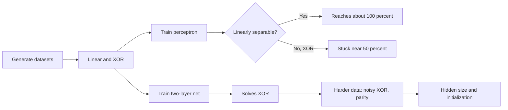
```mermaid
flowchart LR
    A[Generate datasets] --> B[Linear and XOR]
    B --> C[Train perceptron]
    C --> D{Linearly separable?}
    D -- Yes --> E[Reaches about 100 percent]
    D -- No, XOR --> F[Stuck near 50 percent]
    B --> G[Train two-layer net]
    G --> H[Solves XOR]
    H --> I[Harder data: noisy XOR, parity]
    I --> J[Hidden size and initialization]
```

**Part 1: Limits of the perceptron.** I built a linear dataset (25 points, label is 1 when x₂ > x₁) and an XOR dataset (4 points). The perceptron learns the linear boundary almost immediately. On XOR it oscillates and never gets past about 50 percent, which matches the theory: no single line separates XOR.

| Linear dataset | XOR dataset |
|---|---|
| 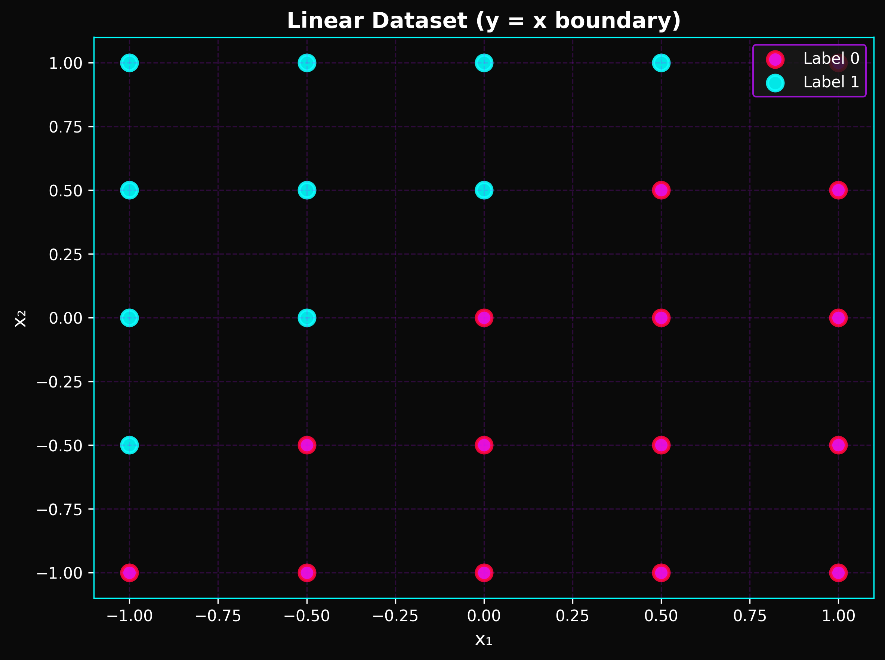 | 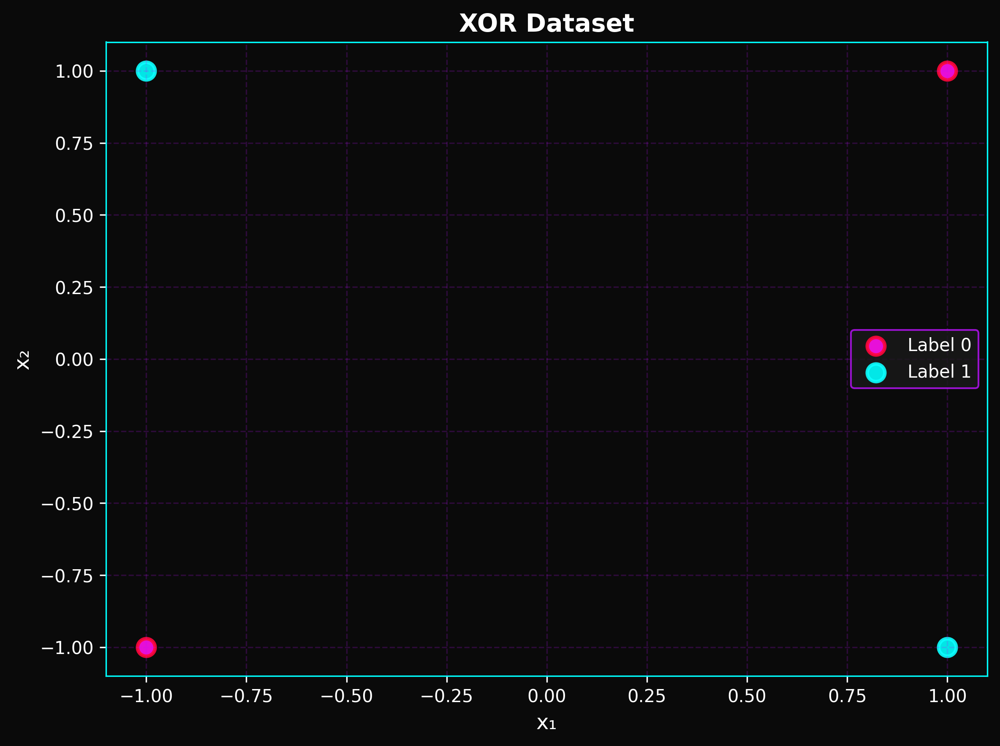 |
| 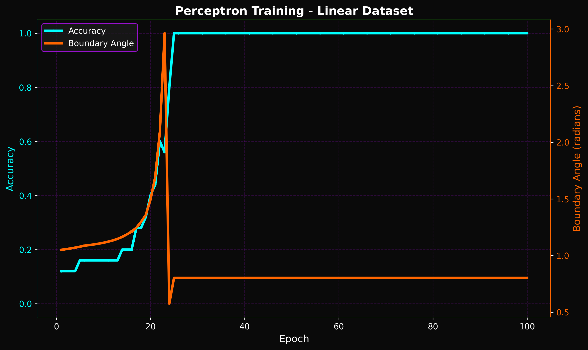 | 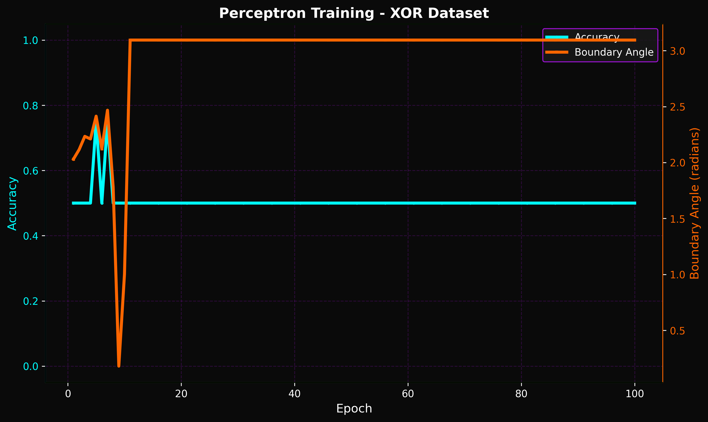 |
| 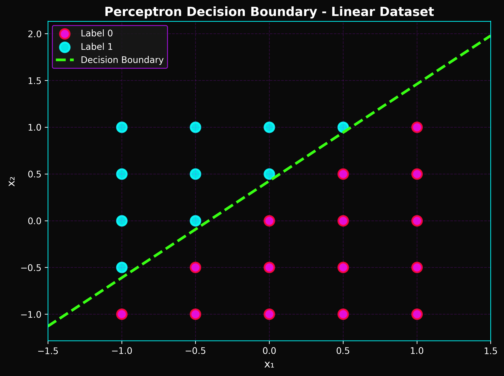 | 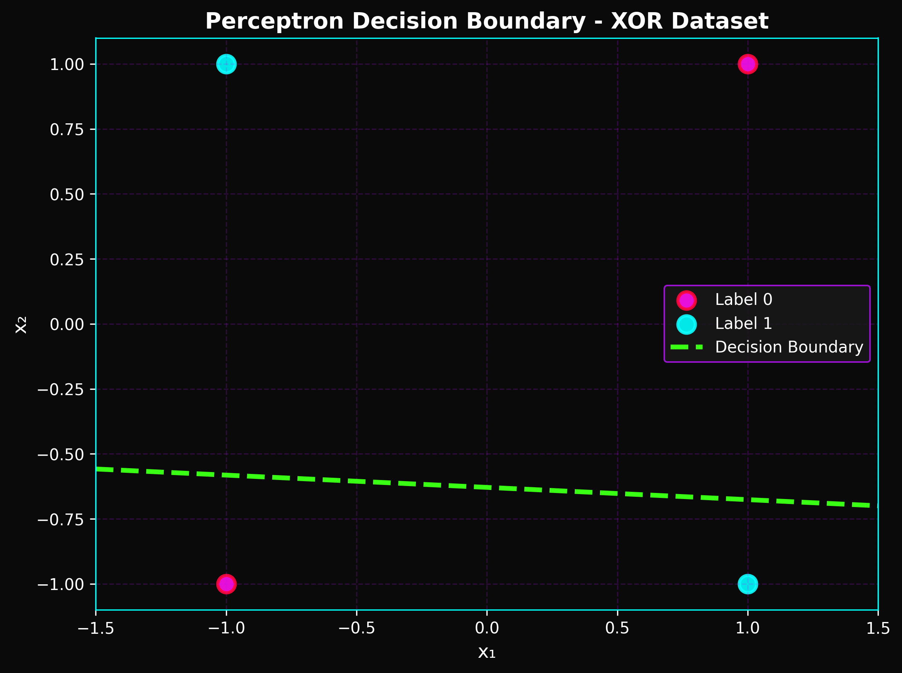 |

**Part 2: Multi-layer models.** A two-layer network with a nonlinear hidden layer learns both the linear and the XOR problems. Results are in `results/part2_*.png`.

**Part 3: Harder datasets.** Noisy XOR at noise levels r = 0.25, 0.5 and 0.75, and parity problems in 4, 6 and 8 dimensions, with different hidden layer sizes. The comparison plots are in `results/part3_*.png`.

| Noisy XOR (r = 0.5) | Parity (dimension 4) |
|---|---|
| 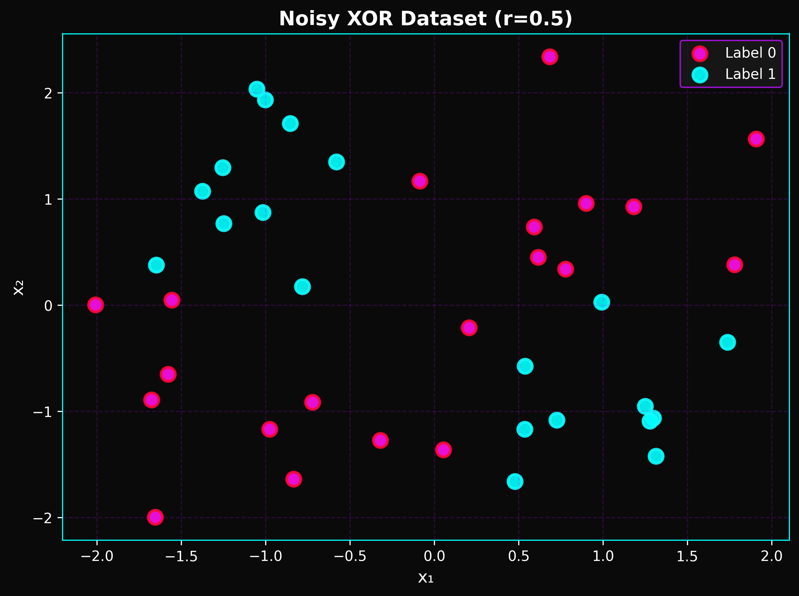 | 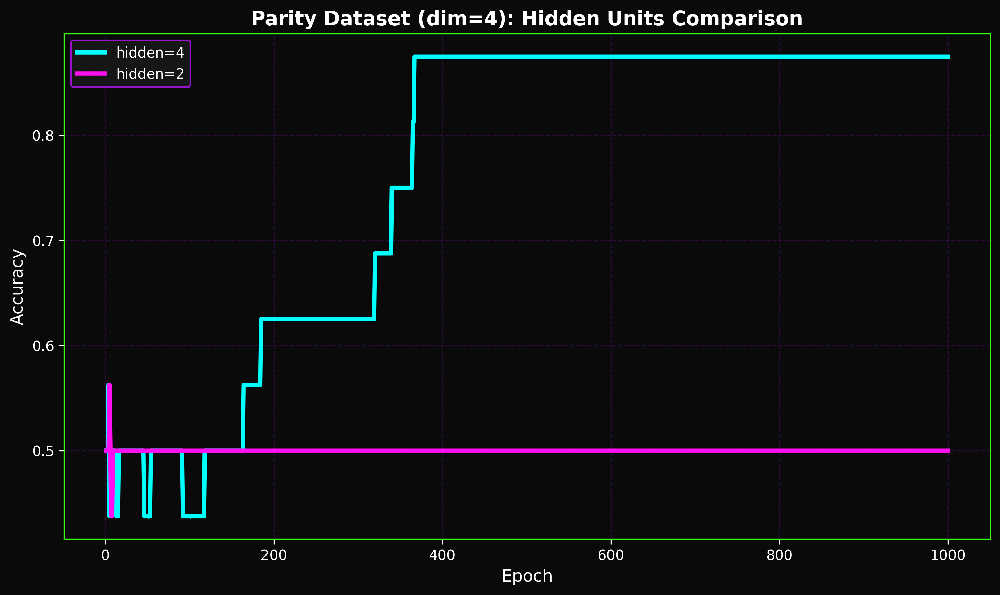 |

**Extra credit: initialization.** `extra_credit.py` checks how weight initialization affects learning.

**Key files:** `perceptron.py`, `two_layer_nn.py`, `datasets.py`, `training_utils.py`, `visualization.py`, `main_experiments.py`, `part3_harder_datasets.py`, `extra_credit.py`. The full write-up is in `Lab_Assignment_1/LAB_REPORT.md`.

## Lab 2: Training deep networks on CIFAR-10

The second lab takes CIFAR-10 (10 classes, 32×32 color images) and asks what makes a deep network trainable. A shallow 2-layer sigmoid network reaches only 39.6 percent, so the dataset is hard enough to show the effects.

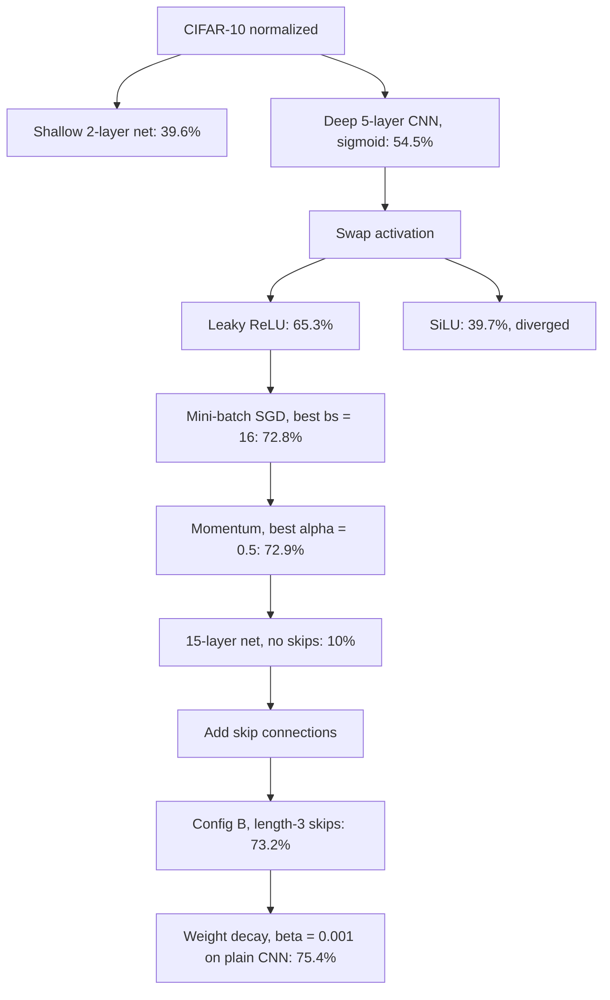
```mermaid
flowchart TD
    A[CIFAR-10 normalized] --> B[Shallow 2-layer net: 39.6%]
    A --> C[Deep 5-layer CNN, sigmoid: 54.5%]
    C --> D[Swap activation]
    D --> E[Leaky ReLU: 65.3%]
    D --> F[SiLU: 39.7%, diverged]
    E --> G[Mini-batch SGD, best bs = 16: 72.8%]
    G --> H[Momentum, best alpha = 0.5: 72.9%]
    H --> I[15-layer net, no skips: 10%]
    I --> J[Add skip connections]
    J --> K[Config B, length-3 skips: 73.2%]
    K --> L[Weight decay, beta = 0.001 on plain CNN: 75.4%]
```

**What I tried, in order:**

1. **Activations.** Sigmoid vanished in the deep network. Leaky ReLU fixed it. SiLU started well and then diverged under batch-size-1 training.
2. **Batch size.** Going from batch size 1 to 16 gave the biggest practical gain. Batch size 64 was still under-trained after 10 epochs.
3. **Momentum.** Momentum made little difference at 0.5, hurt at 0.9, and diverged at 0.99.
4. **Skip connections.** A 15-layer network with no skips never learned anything (10%). Adding three additive skip connections brought it back to 71 to 73 percent. Config B, with longer skips that cover more layers, did best.
5. **Weight decay (extra credit).** Decay of 0.001 helped the plain CNN the most (75.4%). Skip connections were more sensitive to it and preferred 0.0001.

| Model | Test accuracy |
|---|:---:|
| Shallow 2-layer (sigmoid) | 39.6% |
| Deep CNN (sigmoid, batch size 1) | 54.5% |
| Deep CNN (Leaky ReLU, batch size 1) | 65.3% |
| Deep CNN (SiLU, batch size 1) | 39.7% |
| Leaky ReLU, batch size 16 | 72.8% |
| Leaky ReLU, batch size 16, momentum 0.5 | 72.9% |
| 15-layer, no skips | 10.0% |
| Skip Config A (length-2) | 71.0% |
| Skip Config B (length-3) | 73.2% |
| Plain CNN + weight decay 0.001 (extra credit) | 75.4% |

**Plots:**

| Activations: loss | Activations: accuracy |
|---|---|
| 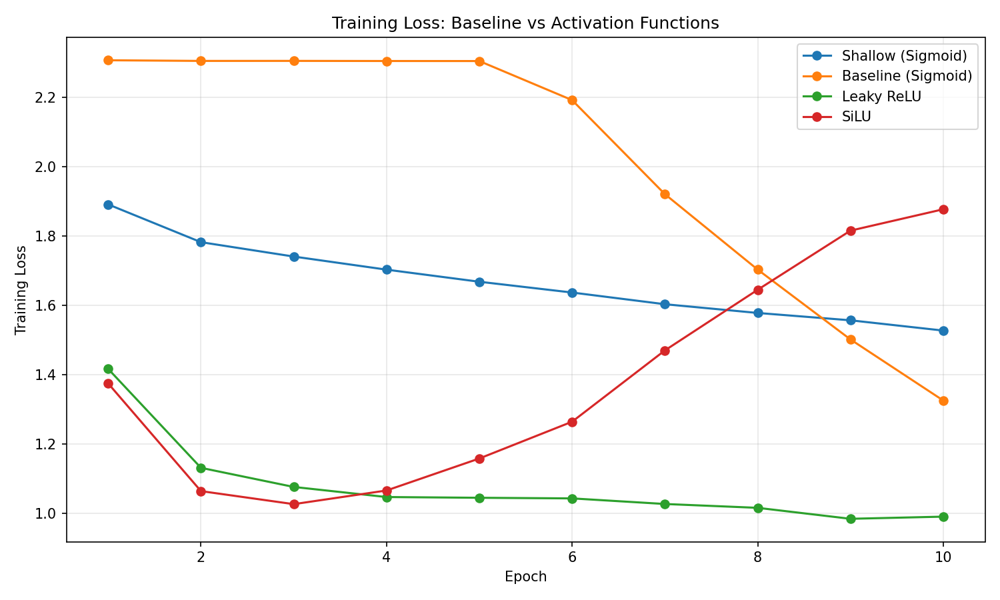 | 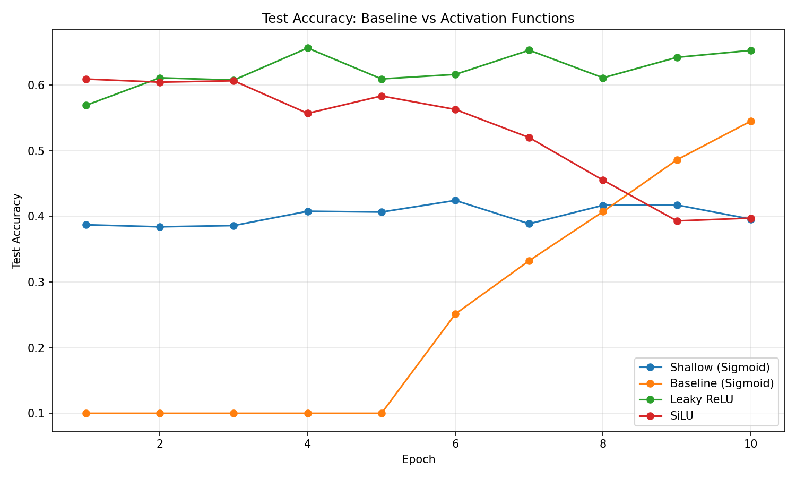 |
| **Batch sizes** | **Momentum** |
| 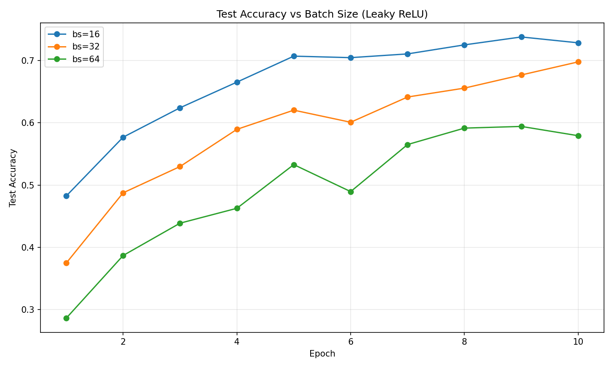 | 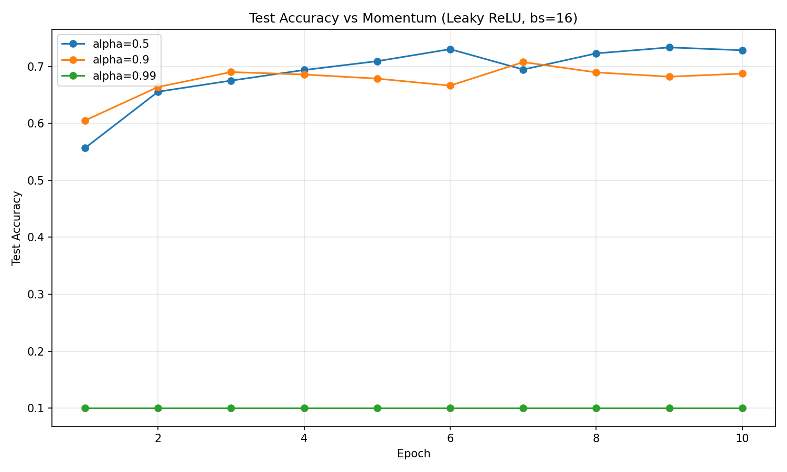 |
| **Skip connections** | **Gradient norms per layer** |
| 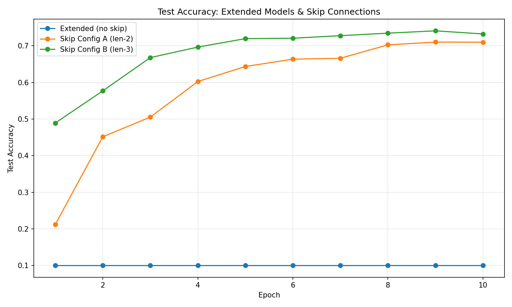 | 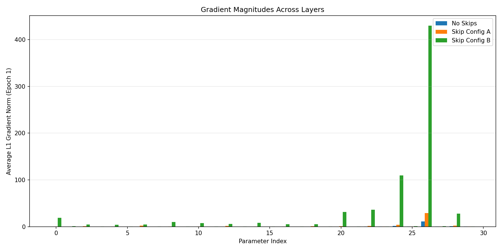 |
| **Weight decay** | **Summary** |
| 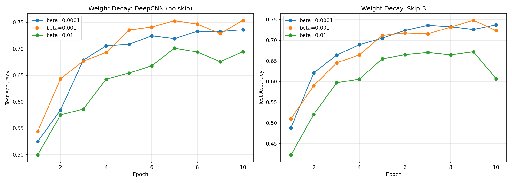 | 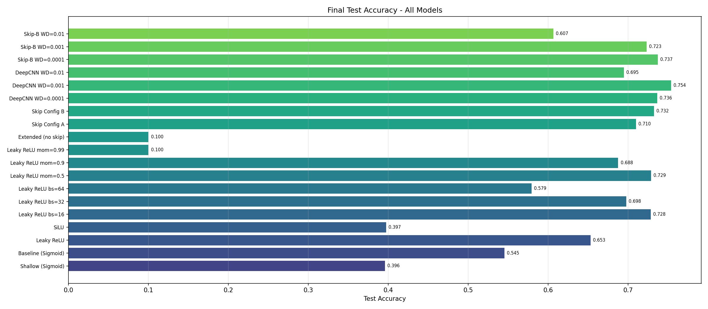 |

The optimizer is plain SGD written from scratch (no `torch.optim`). Gradients come from autograd and the parameters are updated by hand. Details are in `Lab_Assignment_2/lab2_report.md`.

## Lab 3: Visual question answering on VizWiz

The third lab is a visual question answering task on VizWiz, a dataset of photos taken by blind users. The images are often blurry, tilted or badly lit. Each sample has a question, and the model has to do two things:

- **Task 1 (classification):** decide whether the question can be answered from the image.
- **Task 2 (generation):** predict a short answer, chosen from the 1,000 most common answers.

The project has four challenges. Challenges 1 and 2 use models built from scratch. Challenges 3 and 4 use frozen CLIP features.

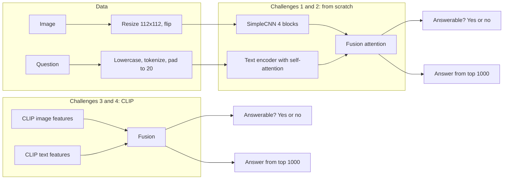
```mermaid
flowchart LR
    subgraph Data
        I[Image] --> R[Resize 112x112, flip]
        Q[Question] --> T[Lowercase, tokenize, pad to 20]
    end
    subgraph Scratch["Challenges 1 and 2: from scratch"]
        R --> CNN[SimpleCNN 4 blocks]
        T --> TE[Text encoder with self-attention]
        CNN --> FU[Fusion attention]
        TE --> FU
    end
    subgraph CLIP["Challenges 3 and 4: CLIP"]
        CI[CLIP image features] --> CF[Fusion]
        CT[CLIP text features] --> CF
    end
    FU --> H1[Answerable? Yes or no]
    FU --> H2[Answer from top 1000]
    CF --> H3[Answerable? Yes or no]
    CF --> H4[Answer from top 1000]
```

**Design decisions:**

- **Image preprocessing.** Images are converted to RGB, resized to 112×112, and randomly flipped during training. I skipped crops and color jitter because the images are already noisy.
- **Answer labels.** For Task 2 the target is the majority answer among the 10 human answers. I compared that with training on all 10 answers separately, and the majority label converged better.
- **Answer vocabulary.** The 41,226 unique answers are mostly rare, so I kept the top 1,000 (about 85 percent of answer occurrences).
- **Image cache.** The 10,000 training images are loaded into one tensor in memory. That cut epoch time from about 2 minutes to about 15 seconds.
- **Attention.** Self-attention in the text encoder lets each word look at the rest of the question. Fusion attention lets the image and text features influence each other.

**Results on the held-out split (from `experiment_results.json`):**

| Experiment | Result |
|---|---|
| Fusion ablation, from scratch (concat / sum / cross-attention) | 81.5% / 80.5% / 69.4% |
| Attention heads 1, 2, 4, 8 (Task 1) | 74.1%, 73.7%, 73.5%, 74.3% |
| Answer vocabulary 500 / 1000 / 2000 (CLIP, Task 2) | 68.9% / 65.3% / 62.1% |
| End-to-end vs CLIP, 50% of training data | 74.3% vs 81.4% |

CLIP features give a clear gain on this data, and the from-scratch model struggles most on answer generation, where it predicts "unanswerable" for most test images. The full analysis, the design rationale and the data-efficiency study are in `Lab_Assignment_3/theory_and_report.md`.

**Files:**

- `solution_e2e.py` and `solution_clip.py`: the two model pipelines.
- `run_experiments.py`, `run_e2e.py`, `data_efficiency.py`: experiment runners.
- `Lab Assignment 3.tex` and `Lab Assignment 3.pdf`: the report.
- `Lab Assignment 3 Annotations/`: train, val and test annotation JSON files.
- `Lab Assignment 3 CLIP/`: precomputed CLIP image and text features as `.pkl` files.
- `rajvardhan_patil_challenge*.pkl|json`: prediction files for the four challenges.

## Problem Sets 1 to 3

Written assignments, with a typed PDF and DOCX version of each.

- **Problem Set 1** (`ProblemSet1_Solutions.md`):
  - Cross-entropy loss: best and worst cases for 10 classes, how the bounds change at 1,000 classes, and the uniform-prediction loss ln(n).
  - Backpropagation through a scalar computational graph, worked step by step.
- **Problem Set 2** (`Problem_Set_2_Answers.md`):
  - Reading two training curves and identifying the likely learning-rate problem.
  - Batch-norm output for a small tensor, computed by hand.
  - Parameter counts and layer sizes for a CNN.
- **Problem Set 3** (`Problem Set 3.pdf`):
  - The self-attention operation: why softmax runs row-wise, why the input is scaled by √H, and how multi-head attention differs from a single head.
  - The transformer block and how its feed-forward layers are sized.

## Running the code

**Lab 1**

```bash
cd Lab_Assignment_1
python3 -m venv venv && source venv/bin/activate
pip install torch numpy matplotlib tqdm
python3 perceptron.py              # Part 1
python3 two_layer_nn.py            # Part 2
python3 part3_harder_datasets.py   # Part 3
```

Plots are written to `results/`.

**Lab 2**

```bash
cd Lab_Assignment_2
python3 -m venv venv && source venv/bin/activate
pip install torch torchvision numpy matplotlib
python3 lab2_experiments.py
```

The CIFAR-10 data is in `data/cifar-10-batches-py/`. It is tracked with Git LFS, so run `git lfs pull` after cloning.

**Lab 3**

```bash
cd "Lab_Assignment_3"
python3 solution_clip.py
python3 solution_e2e.py
```

The VizWiz image folders (`train/`, `test/`, `val/`) are not in this repository. Put them in `Lab_Assignment_3/` before running the end-to-end models.

## What is not in this repository

- **Virtual environments** (`venv/`) and **`node_modules/`**: rebuilt by `pip` and `npm`.
- **VizWiz images** (about 18 GB): too large for GitHub. The annotations and CLIP features are included, so the CLIP pipeline runs without the images.
- **Project folder**: kept in its own repository.
